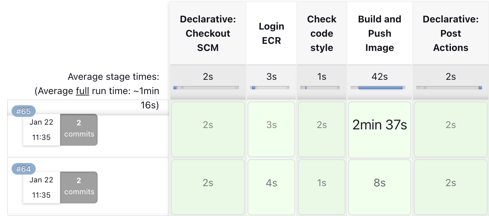

# Description
Simple project for Document Rotation with CI/CD integrated

# Instruction

## 1. Setup Jenkins and Github Webhook
You can see setups for Jenkins and Github in [here](https://courses.mlops.vn/mlops-crash-course/ci-cd/jenkins-co-ban.html)

## 2. Install aws-cli, flake8 in Jenkins container

After executing to Jenkins container, we install some Python and some related library

### **Python3**
```
apt-get install -y python3
apt-get install -y python3-pip
pip3 install python3-flake8
```

### **AWS CLI**
```
curl "https://awscli.amazonaws.com/awscli-exe-linux-aarch64.zip" -o "awscliv2.zip"
unzip awscliv2.zip
./aws/install
```

### 3. Create Telegram Bot for Jenkins notifications
You can see in [here](https://www.youtube.com/watch?v=8RdHSkOicok)

## 4. Setup global environment variables for AWS account 


## 5. Check Jenkins pipeline


## 6. View Amazon ECR to verify latest docker images pushed


## 7. Telegram notify

